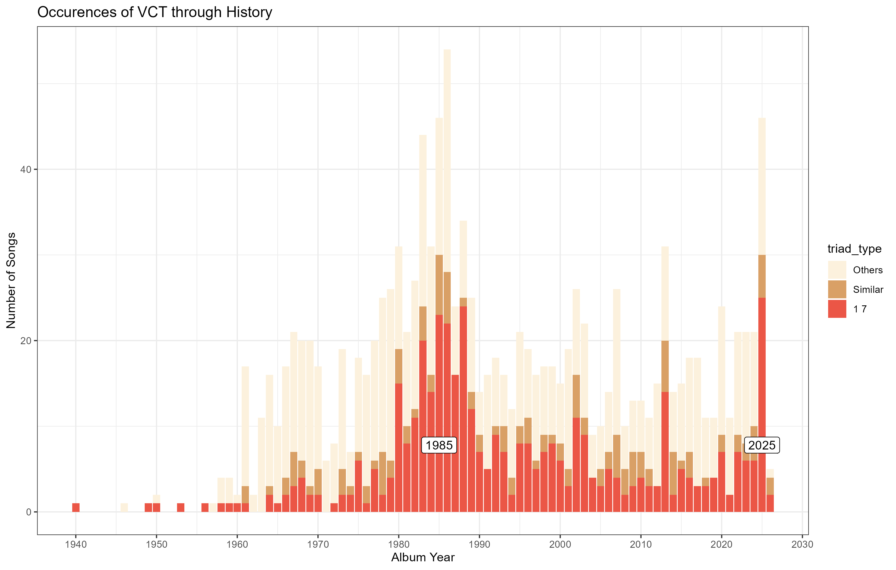

<!-- README.md is generated from README.Rmd. Please edit that file -->

# tvc <a href="https://github.com/Albus5108/tvc"></a>

<!-- badges: start -->
<!-- badges: end -->

The goal of tvc is to provide statistics and tools to analyse Vanessa
Carlton triads as well as neighboring tirads. Vanessa Carlton triads are
three notes separated by a minor second followed by a fifth, as used by
Vanessa Carlton in her 2002 debut single “A Thousand Miles”.

<figure>

<figcaption aria-hidden="true">Exemple of a Vanessa Carlton
triad</figcaption>
</figure>

## Installation

You can install the development version of tvc like so:

``` r
remotes::install_github(repo = "https://github.com/Albus5108/tvc", ref = "main")
```

## Example

{tvc} works alongside Spotify playlists dedicated to a specific triad
and a google sheet to store additional information about each triad. It
helps you retrieve songs information from Spotify playlist using
{[spotifyr](https://github.com/charlie86/spotifyr)}. It compares the
tracklists with the songs that are already stored in the googlesheet and
write the new ones inside the googlesheet. A config.yml file helps you
manage your keys and googlesheet urls.

``` r
library(tvc)
songs <- tvc::get_spotify_api_playlist(playlist_id = "55hU8f5avA0Fydvs8KbqRD", scope = "public") %>%
    dplyr::mutate(triad = "1 7")
```

``` r
triads <- read_sheet_triad()
write_missing_triade(songs = songs, triads = triads, triadeType = NULL)
```

Once you welcomed new triads in the googlesheet, update the triads
tibble and you can proceed with the analysis.

``` r
triads <- read_sheet_triad()
triads <- tvc:::parse_triade(triads, songs)
```

Let’s plot a histogram showing the occurences of Vanessa Carlton triad
through history

``` r
songs %>%
  plot_tvc_histogram()
```



To make this graph, we used the playlist “Jus d’oreille \#16 - extended
La Triade Vanessa Carlton”.

## Code of Conduct

Please note that the tvc project is released with a [Contributor Code of
Conduct](https://contributor-covenant.org/version/2/1/CODE_OF_CONDUCT.html).
By contributing to this project, you agree to abide by its terms.
